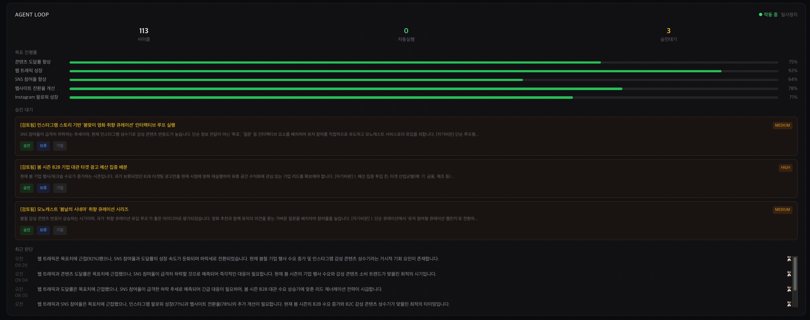
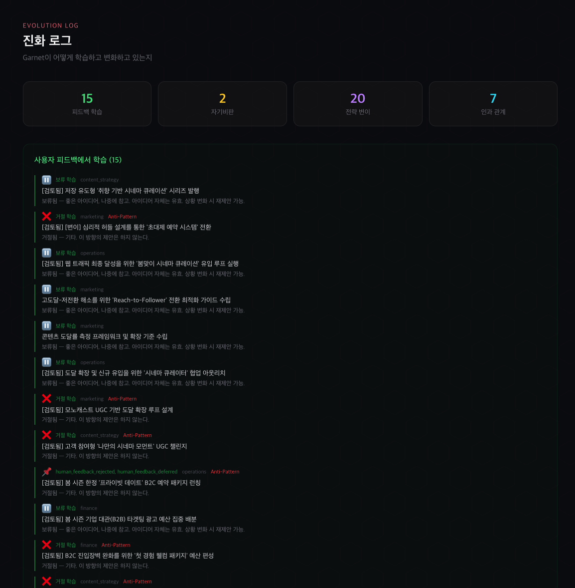
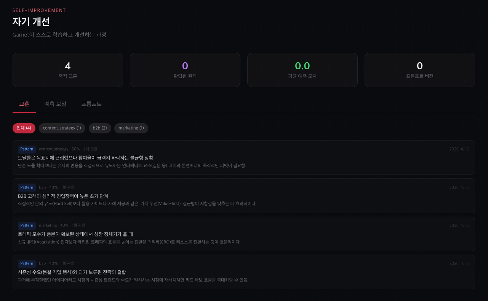
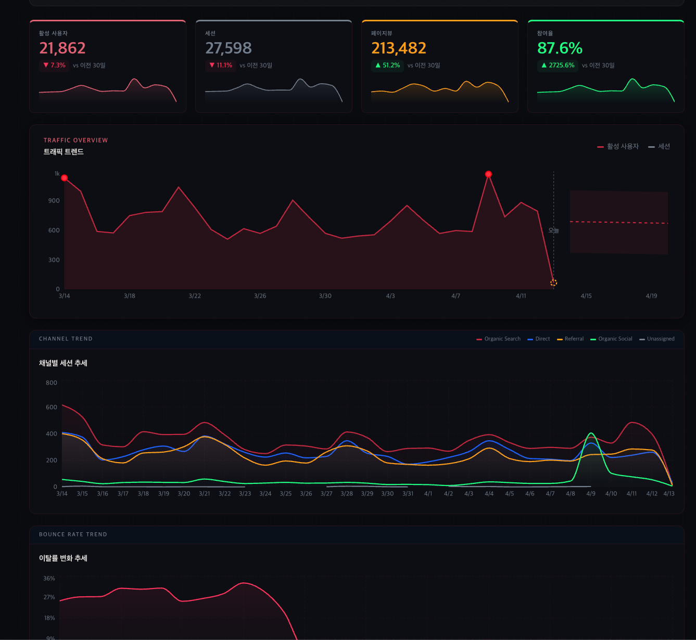

# Garnet

자율 학습하는 개인 AGI 에이전트 시스템.
마케팅을 첫 번째 도메인으로 24시간 자율 운영하며, 스스로 지식을 축적하고 판단을 개선합니다.

> 전체 로드맵: [`docs/GARNET_ROADMAP.md`](docs/GARNET_ROADMAP.md)
> 제품 상태: [`docs/PROJECT_CONTEXT.md`](docs/PROJECT_CONTEXT.md)

## Screenshots

| Agent Loop — 자율 운영 | 진화 로그 — 학습 과정 |
|:---:|:---:|
|  |  |

| 자기 개선 — 사이클 교훈 | GA4 분석 — 실데이터 |
|:---:|:---:|
|  |  |

## 핵심 기능

### Agent Loop (v0.6.0+, 36개 모듈)
- **자율 순환 루프:** 환경 인식(Scanner) → LLM 추론(Reasoner) → 실행/승인(Executor) → 학습
- **다중 주기:** 15분(긴급 감지) / 1시간(루틴 분석) / 7시(데일리 브리핑) / 18시(저녁 보고) / 월 9시(주간 리뷰)
- **4단계 진화 엔진:**
  - Phase 1: Knowledge Engine — 실행 결과 측정, 지식 축적, 인간 피드백 학습
  - Phase 2: Curiosity Engine — 기사 학습, 거시 환경 추적, 교차 도메인 인사이트
  - Phase 3: Causal Reasoning — 인과 모델, 신뢰도 평가, 목표 예측, 전략 변이
  - Phase 4: Reflective Roles — 자기 비판, 역량 벤치마크, 능동 질문, 역할 확장
- **리스크 기반 자율:** LOW 자동 실행, MEDIUM+ Governor 승인 대기
- **알림:** Telegram(주력) + Slack 데일리 브리핑

### 마케팅 OS 기반
- GA4 성과 분석 (이커머스 매출, 트래픽, 채널, 코호트 리텐션)
- Instagram 연동 (OAuth + 인사이트 + 도달 자동 분석)
- SNS 성과 분석 (저장/공유/팔로워/도달)
- Flow Builder (에이전트 파이프라인 비주얼 에디터)
- Agent Shell (자연어 → Flow 자동 설계/실행)
- 세미나 (멀티라운드 AI 토론)
- 캠페인 룸 + 승인 인박스
- 마케팅 인텔리전스 (5개 플랫폼 자동 수집 + AI 분석)

## 기술 스택
- Next.js (App Router, TypeScript) + Tauri v2 데스크톱
- TailwindCSS
- Prisma + PostgreSQL (Supabase)
- LLM: Gemini (기본) / Groq / OpenAI / Claude 폴백 체인
- GA4 Data API (`@google-analytics/data`)
- MCP SDK (`@modelcontextprotocol/sdk`)
- Serper.dev 검색 API
- Telegram Bot API + Slack Webhook

## 환경 변수
`.env` 파일 예시:

```env
DATABASE_URL="file:./dev.db"
NEXT_PUBLIC_APP_URL=http://localhost:3000
NEXT_PUBLIC_SUPABASE_URL=http://127.0.0.1:54321
NEXT_PUBLIC_SUPABASE_PUBLISHABLE_KEY=
NEXT_PUBLIC_SUPABASE_ANON_KEY=
SUPABASE_PROJECT_REF=
SUPABASE_ACCESS_TOKEN=

LLM_PROVIDER=openai
LLM_RUN_PROFILE=manual
LLM_FALLBACK_ORDER=gemini,groq,openai,local,openclaw
FREE_MODE_PROVIDER_ORDER=openclaw,groq,gemini,local
FREE_MODE_ALLOW_PAID_FALLBACK=false
OPENAI_API_KEY=
OPENAI_MODEL=gpt-4.1-mini
OPENAI_ADMIN_KEY=
OPENAI_MONTHLY_BUDGET_USD=

LOCAL_LLM_BASE_URL=http://127.0.0.1:1234/v1
LOCAL_LLM_MODEL=
LOCAL_LLM_API_KEY=

GEMINI_API_KEY=
GEMINI_MODEL=gemini-2.5-flash
GEMINI_DAILY_LIMIT=20

GROQ_API_KEY=
GROQ_MODEL=llama-3.3-70b-versatile

OPENCLAW_AGENT_ID=main
OPENCLAW_BIN=openclaw
OPENCLAW_TIMEOUT_SEC=120
OPENCLAW_FALLBACK_ON_GEMINI_QUOTA=true

SEARCH_API_KEY=
SEARCH_PROVIDER=serper
SEARCH_INCLUDE_DOMAINS=
SEARCH_EXCLUDE_DOMAINS=
APP_UPDATE_URL=
SEMINAR_TICK_MS=45000

# Meta Instagram Reach Agent
META_ACCESS_TOKEN=
INSTAGRAM_BUSINESS_ACCOUNT_ID=
META_GRAPH_API_VERSION=v22.0
INSTAGRAM_AGENT_LOOKBACK_DAYS=30
INSTAGRAM_AGENT_SECRET=
```

- `OPENAI_ADMIN_KEY`: OpenAI 조직 관리자 키(옵션). 있으면 메인 화면에서 월 사용량을 조회합니다.
- `OPENAI_MONTHLY_BUDGET_USD`: 내부 월 예산(옵션). 잔여 예산 계산에 사용됩니다.
- `LLM_PROVIDER`: `openai`, `local`, `gemini`, `groq`, `openclaw`
- `LLM_RUN_PROFILE`: `manual`(수동 provider 선택) 또는 `free`(무료 provider 자동선택)
- `LLM_FALLBACK_ORDER`: 주 provider 실패 시 자동 대체 순서(쉼표 구분, 예: `gemini,groq,openai,local`)
- `FREE_MODE_PROVIDER_ORDER`: 무료모드 자동 선택 순서(기본 `openclaw,groq,gemini,local`)
- `FREE_MODE_ALLOW_PAID_FALLBACK`: 무료모드에서 무료 provider 전부 실패 시 OpenAI로 대체 허용 여부
- `LOCAL_LLM_BASE_URL`: OpenAI 호환 로컬 LLM 엔드포인트(`/v1` 포함)
- `LOCAL_LLM_MODEL`: 로컬 서버에 등록된 모델명
- `GEMINI_API_KEY`: Gemini API 키
- `GEMINI_MODEL`: Gemini 모델명 (예: `gemini-2.5-flash`)
- `GROQ_API_KEY`: Groq API 키
- `GROQ_MODEL`: Groq 모델명 (예: `llama-3.3-70b-versatile`)
- `OPENCLAW_AGENT_ID`: OpenClaw 에이전트 ID (기본 `main`)
- `OPENCLAW_BIN`: OpenClaw CLI 실행 파일명/경로 (기본 `openclaw`)
- `OPENCLAW_TIMEOUT_SEC`: OpenClaw 호출 타임아웃(초, 기본 `120`)
- `OPENCLAW_FALLBACK_ON_GEMINI_QUOTA`: Gemini 429(한도 초과) 시 OpenClaw 자동 대체 실행 여부(기본 `true`)
- `GEMINI_DAILY_LIMIT`: 메인 화면의 `오늘 남은 Gemini 요청 예측치` 계산 기준값(기본 20)
- `SEARCH_INCLUDE_DOMAINS`: 웹서치 허용 도메인 목록(쉼표 구분, 옵션)
- `SEARCH_EXCLUDE_DOMAINS`: 웹서치 제외 도메인 목록(쉼표 구분, 옵션)
- `APP_UPDATE_URL`: 데스크톱 자동 업데이트 피드 URL(옵션). 미설정 시 앱의 `설정 및 복구 > 앱 업데이트`에서 URL 저장 가능
- `SEMINAR_TICK_MS`: 올나잇 세미나 스케줄러 폴링 주기(ms, 기본 45000)
- `NEXT_PUBLIC_SUPABASE_URL`: Supabase API URL. 로컬 기본값은 `http://127.0.0.1:54321`
- `NEXT_PUBLIC_SUPABASE_PUBLISHABLE_KEY`: 앱에서 사용하는 Supabase publishable key
- `NEXT_PUBLIC_SUPABASE_ANON_KEY`: 이전 명칭 anon key를 병행 사용할 때의 fallback 변수
- `SUPABASE_PROJECT_REF`: CLI 원격 연결용 프로젝트 ref(옵션)
- `SUPABASE_ACCESS_TOKEN`: `supabase link`나 배포용 CLI 토큰(옵션, 앱 런타임에는 사용하지 않음)
- `META_ACCESS_TOKEN`: 인스타 인사이트 조회 권한이 포함된 Meta 장기 토큰
- `INSTAGRAM_BUSINESS_ACCOUNT_ID`: 대상 인스타 비즈니스 계정 ID(ig-user-id)
- `META_GRAPH_API_VERSION`: Graph API 버전(기본 `v22.0`)
- `INSTAGRAM_AGENT_LOOKBACK_DAYS`: 실행 시 분석 기본 기간(일, 기본 `30`)
- `INSTAGRAM_AGENT_SECRET`: 자동 실행 보호용 시크릿(옵션)

## 권장 운영 모드
- 무료 운영(권장): `설정 및 복구 > 권장 무료 운영 세팅 적용`
  - 실행 모드: `free`
  - 자동 순서: `OpenClaw -> Groq -> Gemini -> Local`
  - fallback 체인 최대 4개로 제한
- 고품질 보고서: `설정 및 복구 > 고품질 보고서 세팅 적용`
  - 실행 모드: `manual`
  - 사용 가능한 유료/고성능 provider(OpenAI 우선)를 자동 추천

## 실행 방법
1. 의존성 설치
```bash
npm install
```

2. Prisma Client 생성
```bash
npm run prisma:generate
```

3. 개발 실행
```bash
npm run dev
```

4. 프로덕션 빌드
```bash
npm run build
```

5. macOS 패키지 생성 (DMG + ZIP)
```bash
npm run dist
```

## Supabase 로컬 개발
1. Supabase 로컬 스택 실행
```bash
npm run supabase:start
```

2. 로컬 키/URL 확인
```bash
npm run supabase:status
```

3. 필요 시 로컬 DB 초기화
```bash
npm run supabase:db:reset
```

4. 타입 생성
```bash
npm run supabase:gen:types
```

현재 프로젝트에는 아래가 스캐폴드되어 있습니다.
- [`supabase/config.toml`](/Users/rnr/Documents/New%20project/supabase/config.toml)
- [`supabase/migrations/20260316093000_auth_and_org_foundation.sql`](/Users/rnr/Documents/New%20project/supabase/migrations/20260316093000_auth_and_org_foundation.sql)
- [`supabase/migrations/20260316113000_workspace_shared_data.sql`](/Users/rnr/Documents/New%20project/supabase/migrations/20260316113000_workspace_shared_data.sql)
- [`supabase/seed.sql`](/Users/rnr/Documents/New%20project/supabase/seed.sql)
- [`lib/supabase/env.ts`](/Users/rnr/Documents/New%20project/lib/supabase/env.ts)
- [`lib/supabase/client.ts`](/Users/rnr/Documents/New%20project/lib/supabase/client.ts)
- [`components/supabase-auth-panel.tsx`](/Users/rnr/Documents/New%20project/components/supabase-auth-panel.tsx)
- [`components/supabase-auth-chip.tsx`](/Users/rnr/Documents/New%20project/components/supabase-auth-chip.tsx)
- [`components/supabase-auth-callback.tsx`](/Users/rnr/Documents/New%20project/components/supabase-auth-callback.tsx)
- [`app/auth/callback/page.tsx`](/Users/rnr/Documents/New%20project/app/auth/callback/page.tsx)
- [`lib/shared-sync/local-export.ts`](/Users/rnr/Documents/New%20project/lib/shared-sync/local-export.ts)
- [`app/api/supabase/bootstrap/route.ts`](/Users/rnr/Documents/New%20project/app/api/supabase/bootstrap/route.ts)

주의:
- Electron 배포본에는 `service_role`, `secret`, direct Postgres URL을 넣지 않습니다.
- 데스크톱 앱에서는 publishable/anon key만 쓰고, 권한이 필요한 작업은 Edge Functions로 넘기는 방향을 기준으로 합니다.

현재 상태:
- 설정 화면에 `팀 계정과 협업 백엔드` 패널이 추가되어 Supabase 이메일 로그인과 세션 상태 확인이 가능합니다.
- 상단 바에는 Supabase 세션 칩이 표시됩니다.
- 원격 프로젝트에 `auth/organizations` 와 `workspace shared data` 마이그레이션이 모두 적용되었습니다.
- `/api/supabase/bootstrap` 으로 현재 로컬 `Run`, `LearningArchive`, `ApprovalDecision`, `RunProgress`를 sync-ready payload로 내보낼 수 있습니다.

원격 프로젝트에서 다음 설정이 필요합니다.
1. Supabase Dashboard `Authentication > URL Configuration` 에 아래 Redirect URL 등록
   - `http://localhost:3000/auth/callback`
   - `http://127.0.0.1:3000/auth/callback`
   - `http://127.0.0.1:3123/auth/callback`
2. `supabase link --project-ref <project-ref>` 후 원격 마이그레이션 적용
   - `npm run supabase:db:push`

## MCP 서버 실행
앱 내부 데이터를 외부 MCP 클라이언트(Codex, Claude Desktop, Cursor 등)에서 읽고 활용하려면 로컬 stdio MCP 서버를 실행할 수 있습니다.

```bash
npm run mcp:server
```

현재 제공 항목:
- Tools: `list_runs`, `get_run_detail`, `list_datasets`, `get_dataset_detail`, `list_learning_cards`, `get_instagram_reach_summary`
- Resources: `aimd://overview`, `aimd://runs/recent`, `aimd://learning/recent`
- Prompts: `run-retrospective`, `dataset-insight-brief`, `learning-card-pack`

## 자동 업데이트 배포
1. 버전 업데이트: `package.json`의 `version` 증가
2. 새 업데이트 파일 빌드: `npm run dist`
3. 업데이트 서버에 산출물 업로드:
  - `latest-mac.yml`
  - `*.zip` (mac auto-updater 적용 파일)
  - `*.zip.blockmap`
  - `*.dmg` (수동 설치용)
4. 앱에서 `설정 및 복구 > 앱 업데이트`에 업데이트 피드 URL 저장
5. 또는 실행 환경(앱 실행 쉘/런처)에 `APP_UPDATE_URL` 설정
6. 앱에서 `설정 및 복구 > 앱 업데이트`에서:
  - `업데이트 확인`
  - `업데이트 다운로드`
  - `다운로드 후 설치`

### 참고
- 자동 업데이트 확인/설치는 Electron 데스크톱 앱에서만 동작합니다.
- `APP_UPDATE_URL`을 지정해 빌드하면(`npm run dist`/`dist:publish`) 앱 내장 설정(`app-update.yml`)으로 사용자 입력 없이 업데이트 확인이 가능합니다.
- 배포 업로드 자동화가 필요하면 아래 스크립트를 사용하세요.
```bash
# APP_UPDATE_URL을 먼저 설정한 뒤 실행
npm run dist:publish
```

## 주요 라우트

### 에이전트
- `/operations` — 오늘의 브리핑 (홈)
- `/approvals` — 승인 인박스
- `/knowledge` — 지식 저장소
- `/benchmark` — 역량 벤치마크
- `/evolution` — 진화 로그
- `/roles` — 역할 관리

### 프로젝트
- `/campaigns` — 캠페인 룸
- `/flow` — Flow Builder
- `/shell` — Agent Shell
- `/seminar` — 세미나 워룸

### 데이터
- `/analytics` — GA4 분석 대시보드
- `/social` — SNS 성과 분석
- `/datasets` — 데이터 실험실

### API
- `/api/agent-loop/control` — Agent Loop 제어 (시작/중지/트리거)
- `/api/agent-loop/status` — Agent Loop 상태 조회
- `/api/ga4/ecommerce` — GA4 이커머스 데이터
- `/api/cron/daily-briefing` — 데일리 브리핑 트리거
