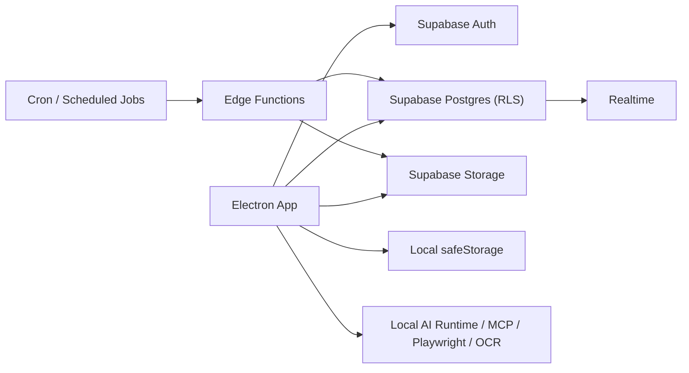

# Supabase 적용 설계안

작성일: 2026-03-16

## 한 줄 결론

이 앱은 `로컬 AI 실행 + 클라우드 협업 데이터` 구조로 가는 것이 가장 적합하다.

- `Supabase Postgres`는 팀이 함께 보는 운영 데이터의 기준 저장소가 된다.
- `Supabase Auth`는 사내 사용자 로그인과 권한 체계를 맡는다.
- `Supabase Storage`는 첨부 파일, 데이터셋 원본, PDF 산출물 저장소가 된다.
- `Supabase Realtime`은 승인 상태, 진행률, 브리핑 신호 같은 운영 UI 갱신에 쓴다.
- `Supabase Edge Functions`와 `Cron`은 웹훅, 주기 수집, 서버 전용 작업에 쓴다.
- 반대로 `LLM 키`, `MCP stdio 연결`, `로컬 실행 환경`, `기기별 설정`은 계속 로컬에 둔다.

이 문서는 현재 Electron + Next + Prisma + SQLite 구조를 기준으로 `무엇을 옮기고 무엇을 로컬 유지할지`, 그리고 `1차 도입 순서`를 정리한다.

## 현재 구조 요약

현재 앱은 다음 특성을 가진다.

- 배포 형태: Electron 데스크톱 앱
- 앱 내부 런타임: embedded Next.js + API routes
- 데이터 저장: Prisma + SQLite
- 기기 설정 저장: Electron `safeStorage`
- 장시간 작업: 세미나 스케줄러, 인스타그램 수집, OCR, Playwright 점검 등 일부 로컬 실행
- 첨부/데이터셋 저장: 현재는 원문 텍스트를 DB 문자열 컬럼에 직접 저장

현재 주요 데이터는 아래와 같다.

- `Run`, `MeetingTurn`, `Deliverable`, `MemoryLog`, `RunAttachment`, `WebSource`
- `Dataset`
- `LearningArchive`
- `InstagramReachDaily`, `InstagramReachAnalysisRun`
- raw SQL 기반 운영 테이블
  - `SeminarSession`
  - `SeminarRound`
  - `SeminarFinalReport`
  - `RunProgress`
  - `ApprovalDecision`

## 핵심 판단

### 1. Supabase는 맞다

Supabase는 프로젝트마다 전체 Postgres DB를 제공하고, Auth/Storage/Realtime/Functions를 한 묶음으로 제공한다. 현재 앱처럼 `데이터`, `협업`, `권한`, `실시간 상태`, `파일`, `주기 작업`이 모두 필요한 제품과 잘 맞는다.

### 2. 하지만 모든 것을 Supabase로 옮기면 안 된다

이 앱은 Electron 데스크톱 앱이다. 따라서 패키지 안에 들어가는 값은 사용자가 추출할 수 있다고 가정해야 한다.

즉 다음은 앱 안에 넣으면 안 된다.

- Supabase `secret` key
- Supabase `service_role` key
- Postgres direct connection string

이 앱에 넣어도 되는 것은 `publishable key` 또는 `anon key`뿐이고, 나머지 권한 상승 작업은 `Edge Functions` 또는 별도 보안 백엔드에서 처리해야 한다.

이 판단은 현재 앱이 데스크톱 클라이언트라는 점과, Supabase 문서가 `desktop app`에는 publishable/anon key를, `secret/service_role`은 백엔드 전용으로 구분한다는 점을 바탕으로 한 설계 판단이다.

### 3. 따라서 권장 구조는 `하이브리드`

권장 아키텍처는 아래와 같다.

정리하면:

- 사람과 팀이 공유해야 하는 데이터는 Supabase
- 기기 전용 설정과 로컬 실행기는 로컬 유지
- 관리자 권한이 필요한 서버 작업은 Edge Functions

## 무엇을 Supabase로 옮길지

### A. 바로 옮겨야 하는 것

#### 1. 사용자/팀/권한 데이터

새로 추가할 테이블:

- `profiles`
- `organizations`
- `organization_memberships`
- `role_definitions` 또는 단순 role enum

이 계층이 먼저 있어야 현재 `사내용 컨트롤 타워`를 여러 명이 함께 쓰는 형태로 갈 수 있다.

권장 컬럼:

- `profiles.id = auth.users.id`
- `profiles.email`
- `profiles.display_name`
- `organizations.id`
- `organizations.name`
- `organization_memberships.user_id`
- `organization_memberships.organization_id`
- `organization_memberships.role`

#### 2. 핵심 운영 데이터

현재 Prisma 모델 중 아래는 Supabase Postgres의 핵심 도메인 데이터가 되어야 한다.

- `Run`
- `MeetingTurn`
- `Deliverable`
- `MemoryLog`
- `WebSource`
- `LearningArchive`
- `ApprovalDecision`
- `RunProgress`
- `SeminarSession`
- `SeminarRound`
- `SeminarFinalReport`
- `InstagramReachDaily`
- `InstagramReachAnalysisRun`

추가 공통 컬럼:

- `organization_id`
- `created_by`
- `updated_by`
- 필요 시 `campaign_id`

현재 `Run`, `LearningArchive`, `Dataset` 등은 개인 로컬 앱 안에서만 살아 있다. 이 데이터를 Supabase로 옮기면 브리핑, 캠페인 룸, 승인 이력, 보고서가 팀 기준으로 일관되게 보이기 시작한다.

#### 3. 파일 메타데이터

현재 `RunAttachment.content`, `Dataset.rawData`처럼 원문을 DB에 직접 넣는 방식은 장기적으로 비효율적이다.

따라서 DB에는 메타데이터만 남기고, 원본은 Storage로 분리해야 한다.

권장 신규 테이블:

- `file_assets`

권장 컬럼:

- `id`
- `organization_id`
- `bucket`
- `path`
- `original_name`
- `mime_type`
- `size_bytes`
- `uploaded_by`
- `source_type`
- `linked_table`
- `linked_id`
- `text_preview`
- `ocr_status`

이후:

- `RunAttachment.content` -> Storage object + `text_preview`
- `Dataset.rawData` -> Storage object + 샘플/요약/정규화 결과
- PDF 보고서 -> Storage object

### B. 2차로 옮기는 것이 좋은 것

#### 4. 캠페인 중심 모델

현재 `campaign-rooms`는 계산 레이어 중심이다. Supabase 도입 시점에 아래를 정식 테이블로 만들면 운영 OS가 훨씬 강해진다.

- `campaigns`
- `campaign_kpis`
- `campaign_channels`
- `campaign_actions`
- `campaign_recommendations`

이렇게 되면 지금의 집계형 UI가 진짜 협업형 데이터 모델을 갖게 된다.

#### 5. 감사 로그와 운영 이벤트

사내 제품 성격상 나중에는 아래가 필요하다.

- `audit_logs`
- `activity_events`
- `integration_events`

예:

- 누가 어떤 보고서를 승인했는지
- 어떤 Edge Function이 언제 어떤 Meta 수집을 돌렸는지
- 어떤 사용자가 어떤 캠페인 KPI를 수정했는지

### C. Edge Functions / Cron으로 옮길 것

다음은 로컬 기기보다 서버에서 돌리는 것이 맞다.

- Meta / Instagram 주기 수집
- 향후 웹훅 수신
- Notion 발행
- 보고서 내보내기 후 공용 저장
- 팀 공용 알림 발송
- 야간 집계/브리핑용 배치

특히 주기 수집은 `Supabase Cron`을 기반으로 짧은 단위 작업으로 쪼개는 것이 적합하다.

## 무엇을 로컬 유지할지

### A. 반드시 로컬 유지

#### 1. 런타임 비밀값

- OpenAI/Gemini/Groq 등 사용자 또는 운영자가 넣는 API 키
- MCP stdio 연결 정보
- 로컬 LLM base URL
- Meta 실험용 토큰이나 임시 수동 키

이 값들은 현재처럼 Electron `safeStorage`에 두는 것이 맞다.

#### 2. 로컬 전용 실행기

- MCP stdio 서버
- Playwright 로컬 자동화
- OCR 임시 처리
- OpenClaw, 로컬 LLM, OS 의존 바이너리
- 앱 업데이트 설정

이들은 기기 상태에 의존하므로 Supabase로 옮길 대상이 아니다.

#### 3. 사용자 기기 캐시

- 최근 열어본 데이터
- 초안 저장
- 오프라인 임시 결과
- 최근 브리핑 스냅샷

이 영역은 로컬 캐시로 유지하고, 필요시 서버와 동기화하면 된다.

### B. 1차에서는 로컬 유지하는 것이 좋은 것

#### 4. 장시간 세미나 실행 엔진

현재 세미나는 긴 시간 동안 라운드 단위로 진행된다. 이를 곧바로 Edge Functions로 옮기면 실행 모델이 크게 바뀐다.

1차에서는:

- `세미나 상태/결과 저장`만 Supabase로 옮기고
- `실행 엔진`은 로컬 유지

가 더 안전하다.

이후 2차에서:

- 세미나를 짧은 잡 단위로 쪼개고
- Cron + queue + function으로 재설계

하는 것이 맞다.

#### 5. AI 실행 본체

현재 워룸 실행은 사용자의 로컬 런타임과 설정에 많이 의존한다.

1차에서는:

- AI 추론은 계속 로컬에서 돌리고
- 결과만 Supabase에 기록

가 현실적이다.

이후 팀 공용 실행기로 옮기고 싶으면 별도 서버 추론 계층을 추가해야 한다.

## 권장 목표 구조

### 1. 배포 구조

#### 현재

- Electron 앱 안에 UI + API + DB가 모두 들어 있음

#### 목표

- Electron 앱: UI + 로컬 실행기 + 안전 저장소
- Supabase: Auth + Postgres + Storage + Realtime
- Edge Functions: privileged backend

즉 Electron은 `로컬 에이전트 클라이언트`, Supabase는 `공용 운영 백엔드`가 된다.

### 2. 데이터 접근 구조

#### 사용자 권한 데이터

- Renderer / browser context에서 `publishable/anon key` + Auth 세션 사용
- 모든 공유 데이터는 RLS 기반 접근

#### 관리자/백엔드 권한 데이터

- Edge Functions 또는 별도 관리자 서버에서만 `secret/service_role` 사용

#### Prisma 사용 전략

Prisma는 Supabase Postgres에 연결할 수 있다. 다만 정식 배포된 Electron 앱 안에 direct DB connection을 넣는 것은 권장하지 않는다.

따라서 Prisma는 주로 다음 용도로 제한하는 편이 좋다.

- 로컬 개발
- 마이그레이션
- 시드/관리 스크립트
- 내부 관리자 백엔드

정식 데스크톱 배포본은 가능하면 `supabase-js + RLS + Edge Functions` 축으로 읽고 쓰는 방향이 더 안전하다.

이건 Supabase가 Prisma 연결을 지원한다는 사실과, 현재 앱이 데스크톱 클라이언트라는 보안 제약을 함께 고려한 설계 판단이다.

## 현재 모델 기준 이동 표

| 영역 | 현재 | 권장 위치 |
|---|---|---|
| 사용자 로그인 | 없음/로컬 중심 | Supabase Auth |
| 팀/역할 | 없음 | Supabase Postgres |
| Runs/회의/보고서 | SQLite | Supabase Postgres |
| LearningArchive | SQLite | Supabase Postgres |
| ApprovalDecision | raw SQLite table | Supabase Postgres |
| RunProgress | raw SQLite table | Supabase Postgres + Realtime |
| Seminar tables | raw SQLite tables | Supabase Postgres |
| Instagram analytics | SQLite | Supabase Postgres + Cron/Functions |
| 첨부 파일 원본 | DB 문자열 | Supabase Storage |
| Dataset 원본 | DB 문자열 | Supabase Storage |
| OCR/미리보기 텍스트 | DB/로컬 | DB 요약 + 로컬 임시 |
| API keys | safeStorage | 로컬 유지 |
| MCP stdio 연결 | safeStorage | 로컬 유지 |
| Playwright/OCR/OpenClaw | 로컬 실행 | 로컬 유지 |
| 업데이트 설정 | 로컬 파일 | 로컬 유지 |

## 1차 도입 순서

### Phase 0. 아키텍처 정리

먼저 아래를 정리한다.

- 현재 raw SQL 테이블을 정식 스키마 목록으로 승격
- 어떤 화면이 공용 데이터인지 정의
- 어떤 값이 기기 전용 비밀값인지 분리

산출물:

- Postgres 기준 ERD 초안
- RLS 대상 테이블 목록
- Storage bucket 설계

### Phase 1. Supabase 개발 환경 세팅

먼저 로컬 Supabase를 띄워 병행 개발 가능 상태를 만든다.

권장 작업:

1. Supabase CLI 도입
2. `supabase init`
3. 로컬 스택 실행
4. `.env.local`에
   - `NEXT_PUBLIC_SUPABASE_URL`
   - `NEXT_PUBLIC_SUPABASE_PUBLISHABLE_KEY` 또는 `anon`
   - 개발 전용 DB URL
   를 분리

이 단계에서는 SQLite를 바로 버리지 말고, 병행 상태를 유지한다.

### Phase 2. Auth + 조직 모델 도입

가장 먼저 넣을 서버 공용 기능은 Auth다.

권장 작업:

1. Supabase Auth 활성화
2. PKCE 기반 로그인 적용
3. Electron에서 세션 저장용 custom storage adapter를 현재 safeStorage에 연결
4. `profiles`, `organizations`, `organization_memberships` 생성
5. 기본 역할 정의

이 단계가 끝나면 앱은 `개인 로컬 툴`에서 `팀 로그인 앱`으로 성격이 바뀐다.

### Phase 3. 공유 데이터의 기준 저장소 이동

다음 데이터를 Supabase Postgres로 옮긴다.

우선순위:

1. `Run`
2. `MeetingTurn`
3. `Deliverable`
4. `MemoryLog`
5. `LearningArchive`
6. `ApprovalDecision`
7. `RunProgress`

이유:

- 브리핑
- 캠페인 룸
- 보고서
- 승인

이 모두 이 데이터에 의존하기 때문이다.

이 단계에서는 현재 Prisma 호출부를 바로 전부 바꾸지 말고, 읽기 전용 화면부터 단계적으로 옮긴다.

### Phase 4. Storage 분리

다음으로 첨부와 데이터셋을 분리한다.

권장 작업:

1. `file_assets` 메타 테이블 생성
2. `run-attachments` bucket 생성
3. `datasets` bucket 생성
4. `reports` bucket 생성
5. 업로드 시 원본은 Storage, 텍스트 추출 결과는 DB 메타 필드로 저장

이 단계가 끝나면 DB 비대화를 크게 줄일 수 있다.

### Phase 5. Realtime 적용

Realtime은 1차에서 아래 3개만 먼저 붙인다.

- `RunProgress`
- `ApprovalDecision`
- `SeminarSession` / `SeminarRound`

이렇게 하면:

- 브리핑
- 승인 대기함
- 세미나 상태

가 새로고침 없이 반영되기 시작한다.

### Phase 6. 서버 전용 작업 이관

그다음에만 Edge Functions / Cron을 붙인다.

1차 권장 대상:

- 인스타그램 주기 수집
- Notion 발행
- 일간 브리핑 집계
- 보고서 후처리

보류 대상:

- 장시간 세미나 전체 실행기
- 로컬 Playwright/OCR
- MCP stdio 작업

## 가장 먼저 구현할 실제 1차 범위

실제 개발 착수 범위를 더 좁히면 아래가 가장 현실적이다.

### 1차 범위

1. Supabase 프로젝트 생성
2. 로컬 Supabase CLI 환경 구성
3. `profiles`, `organizations`, `organization_memberships` 추가
4. `Run`, `MeetingTurn`, `Deliverable`, `MemoryLog`, `LearningArchive`를 Postgres 기준으로 재정의
5. `RunProgress`, `ApprovalDecision`, `Seminar*` raw 테이블을 정식 마이그레이션 테이블로 승격
6. 첨부/데이터셋용 Storage 설계
7. Electron safeStorage 기반 PKCE 세션 저장 어댑터 설계

### 1차에서 하지 않을 것

- AI 실행기를 서버로 이전
- 모든 화면을 한 번에 Supabase로 전환
- Meta 실시간 분석 완성
- 세미나 24시간 엔진을 Edge Functions로 이관
- MCP stdio를 클라우드화

## 리스크와 주의점

### 1. 현재 앱 내부 API는 “진짜 백엔드”가 아니다

지금 Next API route는 사용자 기기 안에서 실행된다. 따라서 여기에 `service_role`이나 direct DB URL을 넣으면 사실상 클라이언트에 비밀을 배포하는 셈이다.

이 부분은 Supabase 도입 시 가장 먼저 인식해야 한다.

### 2. raw SQL 테이블이 많다

지금 `Seminar*`, `RunProgress`, `ApprovalDecision`은 Prisma schema 밖에서 관리된다. Supabase/Postgres로 옮길 때는 반드시 정식 migration 대상으로 승격해야 한다.

### 3. 대용량 텍스트가 DB에 많다

`RunAttachment.content`, `Dataset.rawData`, 세미나 보고서 원문 등은 그대로 Postgres에 넣으면 비용과 성능 모두 안 좋아진다.

Storage 분리를 초기에 해야 한다.

### 4. RLS를 늦게 넣으면 나중에 더 힘들다

팀/조직 구조가 생기는 순간, `organization_id` 없이 쌓인 데이터는 정책 설계가 급격히 어려워진다.

따라서 공용 데이터는 처음부터:

- `organization_id`
- `created_by`
- `updated_by`

를 붙이고 시작하는 것이 좋다.

## 추천 최종 방향

현재 앱 기준 최선의 방향은 다음이다.

1. 이 앱을 완전한 클라우드 SaaS로 갑자기 바꾸지 않는다.
2. 먼저 `로컬 에이전트 + 공용 데이터 백엔드` 구조로 바꾼다.
3. Supabase는 협업 데이터, 로그인, 파일, 실시간 상태를 담당한다.
4. 로컬 런타임과 비밀값은 계속 Electron이 맡는다.
5. 권한이 필요한 서버 작업은 Edge Functions로 이동한다.

이 방향이면 지금까지 만든 제품 특성을 버리지 않으면서도, `정식 배포 가능한 사내 운영 프로그램`으로 자연스럽게 올라갈 수 있다.

## 참고 자료

- Supabase Database Overview: https://supabase.com/docs/guides/database/overview
- Supabase Prisma: https://supabase.com/docs/guides/database/prisma
- Supabase Auth: https://supabase.com/docs/guides/auth
- PKCE Flow: https://supabase.com/docs/guides/auth/sessions/pkce-flow
- Supabase Storage: https://supabase.com/docs/guides/storage
- Supabase Realtime: https://supabase.com/docs/guides/realtime
- Row Level Security: https://supabase.com/docs/guides/database/postgres/row-level-security
- Supabase Edge Functions: https://supabase.com/docs/guides/functions
- Supabase Cron: https://supabase.com/docs/guides/cron
- Supabase CLI: https://supabase.com/docs/guides/local-development/cli/getting-started
- Securing your data: https://supabase.com/docs/guides/database/secure-data
- Understanding API keys: https://supabase.com/docs/guides/api/api-keys
